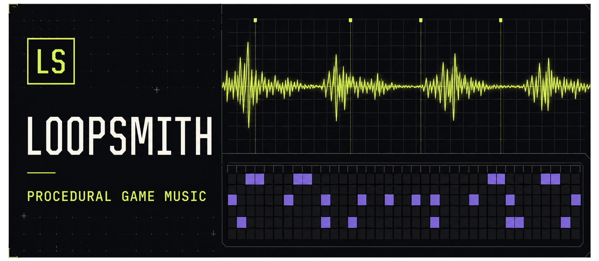

<div align="center">
  <a href="https://gamingtoolset.github.io/loopsmith-music-generator/website/">
    
  </a>

  <h1>LoopSmith</h1>

  <p><strong>Compose, shape, audition, and transfer procedural game loops — entirely in your browser.</strong></p>
  <p>A zero-dependency music laboratory for reproducible, code-first game soundtracks.</p>

  <p>
    <a href="https://gamingtoolset.github.io/loopsmith-music-generator/"></a>
    <a href="https://announcerua.itch.io/loopsmith-music-generator"></a>
    <a href="https://github.com/GamingToolset/loopsmith-music-generator"></a>
  </p>

  <p>
    
    
    
    
    
    <a href="https://github.com/GamingToolset/loopsmith-music-generator/blob/main/LICENSE"></a>
  </p>

  <p>
    <a href="https://github.com/GamingToolset/loopsmith-music-generator/stargazers"></a>
  </p>
</div>

> [!NOTE]
> LoopSmith synthesizes every note locally. It does not upload your seeds, arrangements, handoff data, or rendered audio.

## Contents

- [Why LoopSmith](#why-loopsmith)
- [Highlights](#highlights)
- [Quick start](#quick-start)
- [Project structure](#project-structure)
- [Using the studio](#using-the-studio)
- [How generation works](#how-generation-works)
- [Reproducibility](#reproducibility)
- [Export formats](#export-formats)
- [Testing](#testing)
- [Browser support](#browser-support)
- [Troubleshooting](#troubleshooting)
- [Contributing](#contributing)

---

## Why LoopSmith

LoopSmith is designed for games that synthesize music at runtime instead of shipping prerecorded tracks. The browser studio uses the Web Audio API to produce melody, bass, optional pad, lightweight drums, and reference sound effects without downloading samples or contacting an external service.

| Compose | Shape | Ship |
| :--- | :--- | :--- |
| Generate seeded motifs, related phrases, harmony, bass, pads, and soft percussion. | Edit all 36 steps, transpose the loop, and tune energy, density, brightness, space, and swing. | Export WAV previews, structured JSON, Godot constants, or an agent-ready implementation brief. |

The application remains deliberately portable:

- no framework, package manager, account, API key, or build step;
- no runtime dependencies or remote assets;
- direct `file://` support through ordered classic scripts;
- deterministic melodic composition from a seed and the selected controls;
- local synthesis, rendering, and export;
- a compact JSON and Godot-oriented integration contract.

## Highlights

| | Capability | What it gives you |
| :---: | :--- | :--- |
| 🎼 | **Phrase-based generation** | Handcrafted motifs develop into related phrases, answer phrases, variations, and a resolving coda instead of unrelated random notes. |
| 🎛️ | **Sixteen musical characters** | Coherent ranges for tempo, energy, density, brightness, space, swing, scales, layers, and voice styles. |
| ▦ | **Editable 36-step sequencer** | Direct control over every scale degree and rest while keeping the composition easy to inspect. |
| ◆ | **Constrained density** | 28–36 active notes, protected downbeats and coda, no adjacent generated rests, and no more than one rest per visual bar. |
| ◉ | **Stable real-time audio** | Look-ahead Web Audio scheduling for melody, bass, pad, and percussion, plus transparent peak protection. |
| 〽 | **Live signal view** | A responsive waveform that follows the analyser without rebuilding hundreds of sequencer controls on every step. |
| ⇩ | **Portable exports** | WAV, JSON, Godot constants, and a complete implementation prompt for a coding agent. |
| ⌁ | **Offline and private** | Seeds, settings, melodies, handoff data, and rendered audio remain on the device. |

## Quick start

1. Download or clone the repository.
2. Open `index.html` in a current desktop browser.
3. Press **Play** to audition the original loop.
4. Press **New loop · change everything** to generate a new musical character.
5. Adjust the controls or click cells in the melody grid.
6. Export a WAV preview or expand **Game handoff** to copy integration data.

No installation command is required. If a browser or local security policy restricts `file://` pages, serve the directory with any static server, for example:

```bash
python -m http.server 8080
```

Then open `http://localhost:8080`.

## Project structure

```text
LoopSmith/
├── index.html                    # Accessible application shell
├── assets/
│   ├── css/
│   │   ├── base.css              # Tokens, reset, shared controls
│   │   ├── app.css               # Studio layout and components
│   │   └── responsive.css        # Responsive layout rules
│   └── js/
│       ├── config.js             # Catalogs, presets, state, shared math
│       ├── generator.js          # Deterministic composition engine
│       ├── audio-engine.js       # Web Audio voices and scheduler
│       ├── export.js             # WAV, JSON, Godot, and agent handoff
│       ├── ui.js                 # Sequencer, waveform, and output views
│       └── main.js               # Initialization and event orchestration
├── website/
│   ├── index.html                # Self-contained one-page presentation
│   └── og.png                    # Social preview card
├── tests/
│   └── generator.test.js         # Determinism and invariant checks
└── README.md
```

The scripts use a small `window.LoopSmith` namespace and load in dependency order. This keeps responsibilities separate while preserving direct browser use and avoiding a bundler.

## Using the studio

### Transport and waveform

- **Play / Stop** starts or stops real-time synthesis.
- **New loop · change everything** selects a different character and regenerates the complete musical identity.
- **Export WAV** renders two repetitions plus a short effects tail at 44.1 kHz.
- The space bar toggles playback when focus is not inside an interactive control.
- The session summary reports key, loop length, and character.

### Melody editor

The sequencer has 36 columns and seven scale-degree rows. Click an empty cell to place the note for that step at the selected degree. Click the active cell again to create a rest.

The generated-density guarantees apply only to generated material. Manual editing is intentionally unrestricted.

### Sound controls

| Control | Effect |
| --- | --- |
| Starting point | Loads a known preset or a generated variation |
| Seed | Reproduces melodic decisions when the other composition controls match |
| Root note | Transposes melody, harmony, and bass |
| Scale | Chooses the pitch collection used by the composition |
| Tempo | Sets step timing and loop duration |
| Energy | Changes note length and layer intensity |
| Note density | Targets 28–36 active generated notes |
| Timbre brightness | Opens the low-pass filter and increases harmonic presence |
| Space | Changes the convolution-reverb send |
| Swing | Delays alternating sequence steps |
| Ambient pad | Adds quiet sustained chord tones |
| Soft drums | Adds a restrained kick-and-hat layer |

### Game SFX

The Tap, Move, Deny, Coin, and Win buttons audition small procedural reference sounds. They use the same audio graph but remain separate from the exported music arrangement.

## How generation works

### 1. Character selection

A full regeneration chooses one of 16 profiles, avoiding the immediately previous profile. A profile supplies safe ranges and weighted choices rather than a fixed song, so variations remain recognizable as members of the same game-music family.

### 2. Motif selection and transformation

One of 16 eight-step motifs becomes phrase `A`. The seeded generator may transpose it, invert its contour, or smooth large scale-degree jumps. All transformations remain inside the selected scale.

### 3. Phrase development

LoopSmith derives related material instead of copying the motif verbatim. It builds `A′`, `A″`, `B`, and `B′` candidates, selects one of four 32-step forms, and appends a four-step cadence that resolves to the tonic.

Example structures include:

- `A A′ B A″ + coda`
- `A B A′ B′ + coda`
- `A A′ A″ B + coda`
- `A B B′ A′ + coda`

### 4. Controlled rests

Requested density is converted to a target note count and clamped to 28–36 active notes. Rest placement then follows musical constraints:

- the first step of every four-step visual bar is preserved;
- the final four-step cadence contains no rests;
- each bar contains at most one rest;
- adjacent rests are rejected;
- weaker beat positions are considered before stronger ones.

Every generated melody passes a structural validation before it reaches the interface.

### 5. Harmony and arrangement

Harmony is selected from 24 four-value semitone progressions. The harmonic root changes every eight sequence steps and cycles when the 36-step melody extends beyond the progression. Bass follows the same harmonic rhythm; pad and drums are enabled by the selected character or by manual controls.

### 6. Synthesis and scheduling

The melodic voice combines a primary oscillator with a quieter harmonic oscillator:

```text
signal = primary(phase) + harmonic_mix × sin(phase × harmonic_ratio)
```

Each note uses a short attack and exponential release to avoid clicks. Brightness controls filtering and harmonic contribution. Space sends the filtered signal to a deterministic convolution impulse. A short look-ahead scheduler queues audio every 25 ms, while visual timers are discarded immediately after use.

## Reproducibility

The melody engine is deterministic for the combination of:

- seed;
- scale;
- density;
- generator version.

Root, tempo, timbre, progression, and layer choices are independent arrangement parameters. To reproduce the complete loop exactly, keep the exported JSON rather than the seed alone. The JSON includes `generator_version: 3` and all current musical and integration values.

## Export formats

### WAV

WAV export uses `OfflineAudioContext` at 44.1 kHz and includes:

- two complete loop repetitions;
- melody and bass;
- enabled pad and drums;
- filtering, convolution space, and output limiting;
- a short tail for releases and reverb.

The WAV is intended for auditioning, review, or reference. The procedural handoff remains the recommended in-game workflow.

### JSON

The stable top-level format identifier remains `loopsmith-game-music-v1`. The payload includes:

```json
{
  "format": "loopsmith-game-music-v1",
  "generator_version": 3,
  "seed": "example-seed",
  "variation_profile": "Classic Dots",
  "tempo": {},
  "harmony": {},
  "composition": {},
  "melody": {},
  "sound": {},
  "arrangement": {},
  "integration": {}
}
```

The composition section reports both active-note counts and realized density, so manual edits remain explicit.

### Godot and agent handoff

The Godot tab provides constants for a runtime implementation based on `AudioStreamGenerator`. The Agent tab adds constraints that help a coding agent preserve the existing Music and SFX buses, public sound-effect methods, volume behavior, and headless checks.

Recommended workflow:

1. Finalize the loop in LoopSmith.
2. Download the JSON as the source of truth.
3. Copy the Agent handoff into the coding task that has access to the game.
4. Ask the agent to inspect the existing audio implementation before editing it.
5. Audition the result in-game and retain the JSON with the project notes.

## Testing

The generator test suite requires Node.js only; it does not install packages:

```bash
node tests/generator.test.js
```

It currently validates 2,000 compositions across every scale and representative density values. The checks cover determinism, legal scale degrees, exact constrained density, preserved downbeats, coda integrity, and per-bar rest limits.

For changes to audio or layout, also verify manually in a current Chromium browser and Firefox:

1. play and stop repeatedly;
2. regenerate while playback is running;
3. edit notes during playback;
4. change tempo, brightness, space, and swing;
5. export WAV and JSON;
6. test keyboard focus and the space-bar shortcut;
7. check the studio and project page at narrow and wide widths.

## Browser support

| Browser | Status |
| --- | --- |
| Chrome | Recommended |
| Microsoft Edge | Recommended |
| Firefox | Supported |
| Safari | Expected to work; autoplay and local-file policies may require an additional user gesture |

The browser must support the Web Audio API. WAV rendering additionally requires `OfflineAudioContext`.

## Privacy and network behavior

The studio does not upload seeds, melodies, settings, handoff text, or audio. It contains no analytics, external fonts, remote scripts, or API calls. The project page also uses local CSS, JavaScript, canvas rendering, and a local social-preview image.

## Troubleshooting

### No sound after pressing Play

- Confirm that the browser tab and operating system output are not muted.
- Press Play directly once; browsers require a user gesture before starting audio.
- Try Chrome or Edge if local-file audio is restricted by the current browser policy.
- Serve the folder over `http://localhost` if direct `file://` access is disabled administratively.

### The waveform is flat

The waveform is intentionally flat while stopped. Start playback and confirm that the header status changes to **Playing**.

### Clipboard copy is blocked

The modern Clipboard API may be unavailable on a `file://` page. LoopSmith falls back to selection-based copying; if the browser blocks both methods, select the handoff text and copy it manually.

### WAV export takes time

The browser renders the complete arrangement faster than real time but still creates every sample for two loops and the effects tail. Slow tempos and enabled spatial effects require more work.

### A seed does not restore every control

The seed reproduces composition decisions under the same scale and density. Use the exported JSON to preserve the full arrangement, including tempo, root, progression, timbre, pad, and drums.

## Design principles

- Prefer musical constraints over uncontrolled randomness.
- Keep generated material reproducible and inspectable.
- Preserve direct manual control after generation.
- Make the browser tool useful without a build system or account.
- Export implementation data, not only rendered audio.
- Keep the runtime small enough to understand and modify.

## Contributing

Contributions are welcome. Good areas for improvement include additional motif libraries, scale families, synthesis voices, stereo movement, engine handoff formats, browser coverage, and sequencer accessibility.

Please keep runtime additions dependency-free unless a dependency provides a clear and substantial benefit. Run the generator tests and describe any changes to the export schema or musical invariants.

## License

LoopSmith is distributed under the Apache License 2.0. See the `LICENSE` file in the published repository for the full terms.
